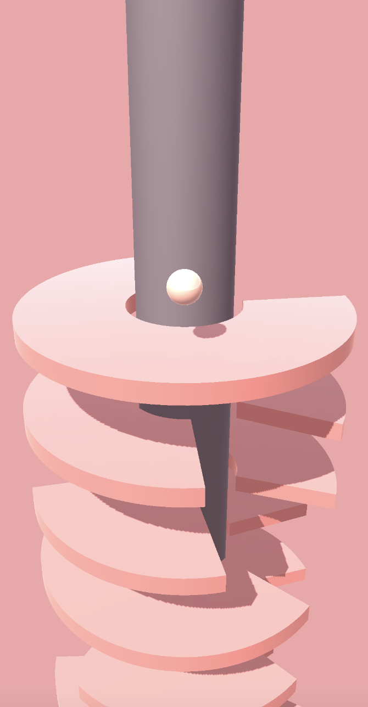

# Helix Jump Clone

[](README.md) [](readme_en.md) 

Этот проект является клоном популярной игры Helix Jump, реализованным с использованием Unity 2020.3.15f2 для платформы Android.

## Скриншоты игры



## Начало работы

### Требования

Прежде чем начать, убедитесь, что у вас установлены следующие компоненты:
- [Unity 2020.3.15f2](https://unity.com/)

### Установка

1. Клонируйте репозиторий:

```bash
git clone https://github.com/ShmuratkoV/helix-jump-clone-unity.git
```

2. Откройте проект в Unity:

Откройте Unity Hub и добавьте проект, выбрав каталог `helix-jump-clone-unity`.

3. Подготовка сборки для Android:

   - Убедитесь, что в настройках проекта выбрана платформа Android.
   - Настройте параметры сборки под Android.

4. Запустите проект в Unity и убедитесь, что он правильно компилируется и запускается на симуляторе.

### Экспорт APK

1. В Unity выберите `File > Build Settings`.
2. В окне настроек сборки выберите платформу Android и нажмите `Switch Platform`.
3. Нажмите `Build` и выберите место для сохранения APK файла.

### Установка на Android-устройство

1. Скопируйте полученный APK файл на ваше Android-устройство.
2. На устройстве разрешите установку из неизвестных источников в настройках безопасности.
3. Установите APK файл на устройстве.

## Загрузка APK файла

Вы можете скачать готовый APK файл со страницы [релизов](https://github.com/ShmuratkoV/helix-jump-clone-unity/releases) этого репозитория.

## Управление

- Проведите по экрану, чтобы вращать башню и направлять шар через просветы.

## Дополнительная информация

- Данный проект использует Unity; вы можете найти более подробную информацию в [документации Unity](https://docs.unity3d.com/).

## Поддержка и вопросы

Если у вас есть вопросы или проблемы, создайте issue в разделе [Issues](https://github.com/ShmuratkoV/helix-jump-clone-unity/issues) данного репозитория.